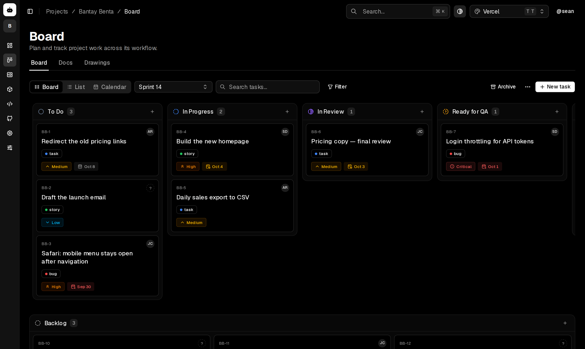
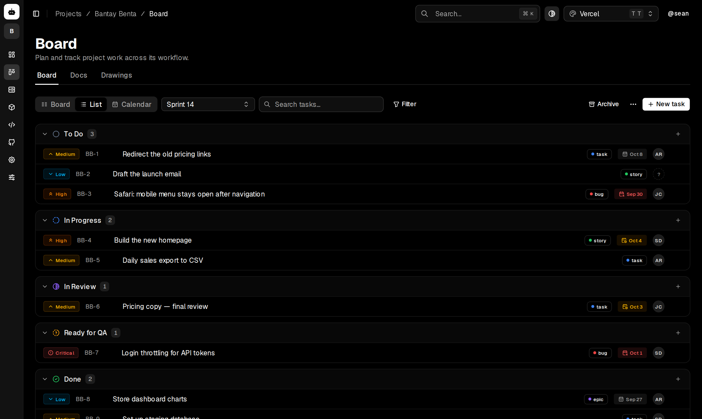
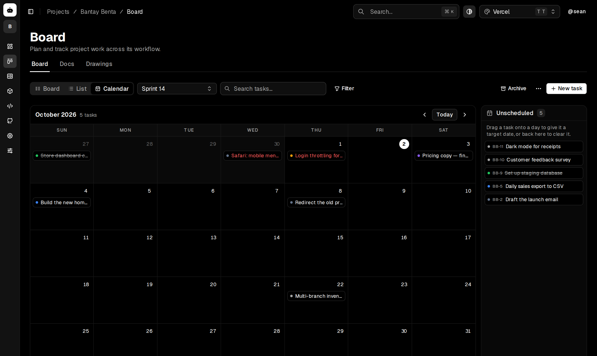

<p align="center">
   1_" />
</p>

<h1 align="center">DevOne</h1>

<p align="center">One workspace for everything developers need.</p>

<p align="center">
  <a href="https://github.com/imnotseanwtf/devone/actions/workflows/ci.yml"></a>
  <a href="https://github.com/imnotseanwtf/devone/releases/latest"></a>
  <a href="LICENSE"></a>
  <a href="https://github.com/imnotseanwtf/devone/pkgs/container/devone"></a>
</p>

<p align="center"><a href="docs/demo.mp4">Watch the demo</a> · every tool in under a minute</p>

<p align="center">
  <a href="https://vercel.com/new/clone?repository-url=https%3A%2F%2Fgithub.com%2Fimnotseanwtf%2Fdevone&project-name=devone&repository-name=devone&env=DATABASE_URL,DEVONE_ENCRYPTION_KEY&envDescription=A%20PostgreSQL%20connection%20string%20and%20an%20encryption%20key%20from%20%60openssl%20rand%20-base64%2032%60&envLink=https%3A%2F%2Fgithub.com%2Fimnotseanwtf%2Fdevone%2Fblob%2Fmain%2Fdocs%2Fdeployment.md%23vercel"></a>
</p>

DevOne is a self-hosted developer workspace that connects project work, Git activity, databases, APIs, documentation, and deployments in one project context.



<table>
  <tr>
    <td></td>
    <td></td>
  </tr>
</table>

## Current MVP

- Next.js 16 and React 19
- TypeScript and Tailwind CSS 4
- shadcn/ui dashboard shell
- GitHub and GitLab personal access token login
- Encrypted provider credentials and database-backed HttpOnly sessions
- PostgreSQL-backed projects and live dashboard counts
- Login throttling and self-hosted GitLab host allowlisting
- Theme support and production Dockerfiles
- Docker Compose with PostgreSQL and Redis

## Tech stack

See [docs/tech-stack.md](docs/tech-stack.md) for every framework, library and service DevOne uses.

## Development

```bash
bun install
cp env.example.txt .env
# Set both database URLs and POSTGRES_PASSWORD, then generate DEVONE_ENCRYPTION_KEY with:
# openssl rand -base64 32
docker compose up -d postgres redis
bun run db:deploy
bun run dev
```

Open [http://localhost:3000](http://localhost:3000).

## Checks

```bash
bun run test
bun run test:db
bun run lint:strict
bun run typecheck
bun run build
```

## Self-hosting

DevOne ships as ready-made Docker images, `ghcr.io/imnotseanwtf/devone` and
`ghcr.io/imnotseanwtf/devone-migrate`, with PostgreSQL and Redis in the Compose stack.

```bash
git clone https://github.com/imnotseanwtf/devone
cd devone
cp env.example.txt .env
openssl rand -base64 32
# Paste the generated value into DEVONE_ENCRYPTION_KEY, choose a PostgreSQL password,
# URL-encode it in both database URLs, then start DevOne:
docker compose pull
docker compose up -d
```

`docker compose pull` fetches the latest release. To stay on a version, set `DEVONE_VERSION=0.1.0`
in `.env`; to build from source instead, run `docker compose up -d --build`.

For the first administrator only, set `DEVONE_ALLOW_BOOTSTRAP=true`, sign in once, then set it
back to `false` and restart the web service. New-user registration is disabled by default.

Open [http://localhost:3000](http://localhost:3000). Use TLS in production so secure session
cookies cannot travel over plaintext connections.

Prefer a managed host? The **Deploy with Vercel** button above creates your own copy; you'll need a
PostgreSQL database (Neon works well) and an encryption key. See [docs/deployment.md](docs/deployment.md#vercel).

## Roadmap

DevOne is young, and the direction is open to discussion. Things we'd like to do next:

- Published Docker images for every release
- A public demo instance
- More interface languages beyond English and Filipino
- Better mobile layouts across the workspace
- Notifications for mentions, assignments and failed pipelines

Have an idea or want to pick one up? Start a thread in [Discussions](https://github.com/imnotseanwtf/devone/discussions) or look for issues labelled [`good first issue`](https://github.com/imnotseanwtf/devone/labels/good%20first%20issue).

## Contributing

Contributions are welcome! Fork the repository, make your change on a branch in your fork, and open a pull request against `dev`. [CONTRIBUTING.md](CONTRIBUTING.md) has the details. Questions are best asked in [Discussions](https://github.com/imnotseanwtf/devone/discussions).

| Branch | Purpose |
|---|---|
| `dev` | Day-to-day development; pull requests go here |
| `staging` | Release candidates, tested before they ship |
| `main` | Released, production-ready code |

Found a security problem? Please report it privately; see [SECURITY.md](SECURITY.md). Everyone taking part is expected to follow the [code of conduct](CODE_OF_CONDUCT.md).

## License

DevOne is released under the [MIT License](LICENSE). It began from the MIT-licensed [Next Shadcn Dashboard Starter](https://github.com/Kiranism/next-shadcn-dashboard-starter).
